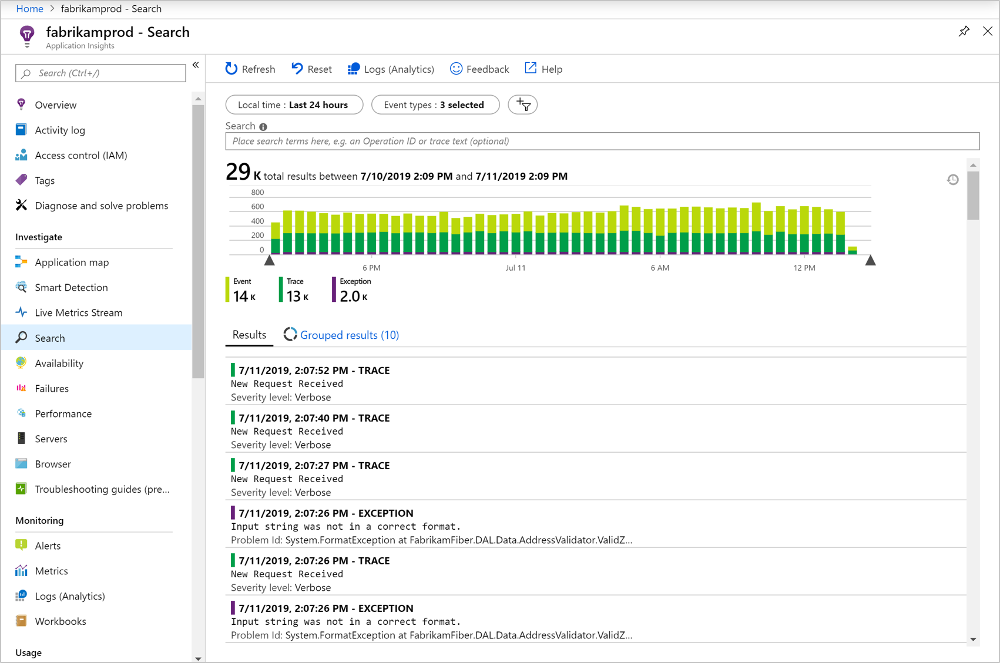

<!-- _footer: 'https://github.com/codebytes/app-insights' -->

# Enhanced Monitoring and Troubleshooting with Azure Application Insights and .NET Aspire's Open Telemetry Dashboard
###  Chris Ayers

---

## Chris Ayers
### Senior Customer Engineer Microsoft

<i class="fa-brands fa-twitter"></i> Twitter: @Chris\_L\_Ayers
<i class="fa-brands fa-mastodon"></i> Mastodon: @Chrisayers@hachyderm.io
<i class="fa-brands fa-linkedin"></i> LinkedIn: - [chris\-l\-ayers](https://linkedin.com/in/chris-l-ayers/)
<i class="fa fa-window-maximize"></i> Blog: [https://chris-ayers\.com/](https://chris-ayers.com/)
<i class="fa-brands fa-github"></i> GitHub: [Codebytes](https://github.com/codebytes)

---

# Agenda

- Azure Application Insights
- Application Insights SDK
- OpenTelemetry
- .NET Aspire
- DEMO
- Questions
  
---

# What is Application Insights?

---

# Application Insights

## Application Performance Monitoring (APM)

- Traces
- Metrics
- End user Experience
- Errors
- Performance

## Features

- Application Map
- Live Metrics
- Smart Detection
- Transaction Search
- Usage
- Sessions

---

# Auto Instrumentation Support

| Environment / Provider | .NETFramework | .NET |  Java | Node.js | Python |
| --- | --- | --- | --- | --- | --- |
| Azure App Service on Windows  | ✅ | ✅ |  ✅ |  ✅ | ❌ |
| Azure App Service on Linux  | ❌ | ✅ | ✅ | ✅ | ✅ |
| Azure Functions - basic | ✅ | ✅ | ✅ | ✅ | ✅ |
| Azure Functions - dependencies | ❌ | ❌ | ✅ | ❌ | ❌ |
| Azure Kubernetes Service (AKS) | ❌ | ❌ | ✅ | ❌ | ❌ |
| VMs Windows | ✅ | ✅ | ✅ | ❌ | ❌ |
| Standalone agent | ❌ | ❌ | ✅ | ❌ | ❌ |

---

# Supported Languages

## OpenTelemetry Distro

- ASP.NET Core
- .NET
- Java
- Node.js
- Python

## SDK (Classic API)

- ASP.NET
- ASP.NET Core
- Java
- Node.js
- Python
- Javascript

---

# Application map

- Spot performance bottlenecks or failure hotspots across all components of your distributed application.
- Each node on the map represents an application component or its dependencies.

---

# Smart Detection

- Automatic alerts based on your app
- Triggers when outside the usual pattern.
- Alerts on custom or standard metrics.

---

# Live Metrics

- Validate a fix while it's released by watching performance and failure counts.
- Watch the effect of test loads and diagnose issues live.
- Get exception traces as they happen.

---

# Transaction Search

- Search in the Portal or Visual Studio
- Filter by Events
- Filter by custom properties
- Filter by exceptions
- Filter by performance
- Filter by dependencies

---

# Usage

- Sessions
- Users
- Page views
- Events
- Cohorts
- Funnels

---

# OpenTelemetry

- **OpenTelemetry** is an open-source observability framework.
- It provides:
  - **Metrics** (Quantitative data on performance)
  - **Logs** (Records of events)
  - **Traces** (Insights into request flows)
- Supports a wide range of programming languages and frameworks.
- Part of the **CNCF** (Cloud Native Computing Foundation).

---

# Why Use OpenTelemetry?

- **Vendor-Neutral**: Collect once, export to any observability platform (e.g., Prometheus, Grafana).
- **Unified Standard**: No need to integrate multiple tools for metrics, logs, and traces.
- **Full Stack Coverage**: From backend services to frontend apps.
- **Improved Monitoring**: Provides deeper insights into distributed systems.
- **Better Root Cause Analysis**: Visualizes the path of a request across services.

---

# Components of OpenTelemetry

- **API**: Defines how applications create and interact with telemetry data.
- **SDK**: Implements the API for different languages.
- **Instrumentation**: Automatically or manually collect data from code.
- **Collectors**: Agent or service that processes and exports telemetry data.
- **Exporters**: Sends data to a monitoring backend like Jaeger, Zipkin, or Prometheus.

---

# OpenTelemetry Collector

---

# Azure Monitor OpenTelemetry Distro

---

# DEMO TIME

---

---

# Resources 

## Links

- [Application Insights overview](https://learn.microsoft.com/en-us/azure/azure-monitor/app/app-insights-overview)
- [Enable Azure Monitor OpenTelemetry for .NET, Node.js, Python, and Java applications](https://learn.microsoft.com/en-us/azure/azure-monitor/app/opentelemetry-enable?tabs=aspnetcore)

## Chris Ayers 

<i class="fa-brands fa-twitter"></i> Twitter: @Chris\_L\_Ayers
<i class="fa-brands fa-mastodon"></i> Mastodon: @Chrisayers@hachyderm.io
<i class="fa-brands fa-linkedin"></i> LinkedIn: - [chris\-l\-ayers](https://linkedin.com/in/chris-l-ayers/)
<i class="fa fa-window-maximize"></i> Blog: [https://chris-ayers\.com/](https://chris-ayers.com/)
<i class="fa-brands fa-github"></i> GitHub: [Codebytes](https://github.com/codebytes)

